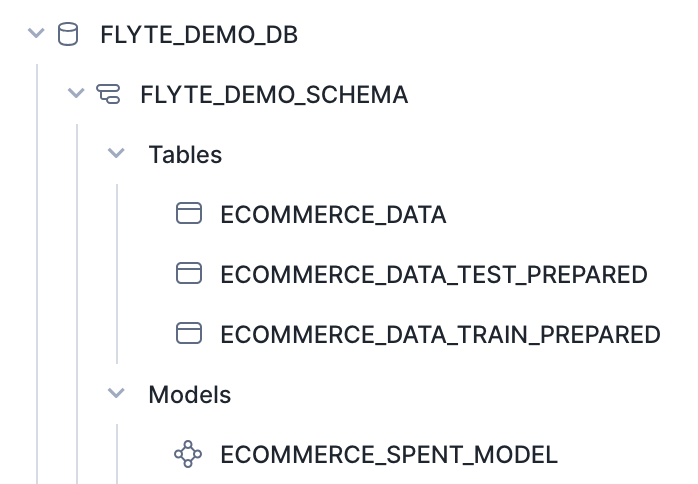
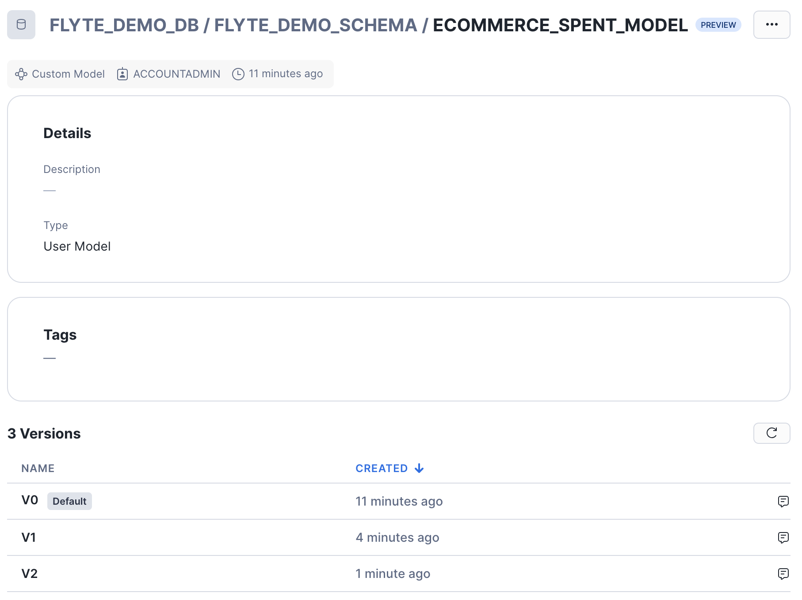

# Snowpark Machine Learning & Flyte

This repository demonstrates how to orchestrate a machine learning pipeline in Snowflake using [Flyte](https://flyte.org).  
The pipeline covers several essential aspects of the ML workflow, including connecting to Snowflake, setting up Snowflake objects, generating artificial data, feature engineering, hyperparameter tuning, and model registry.  

## Introduction

This project showcases how to build a robust machine learning pipeline with Flyte, leveraging Snowflake's powerful data platform.  
The pipeline covers:

1. **Connecting to Snowflake**: Using Flyte secrets and Snowpark to authenticate and connect.
2. **Setting Up Snowflake Objects**: Creating databases, schemas, and warehouses using Snowflake's Python API.
3. **Data Generation**: Generating artificial ecommerce data for demonstration purposes.
4. **Feature Engineering**: Handling missing values (imputation) and encoding categorical variables.
5. **Hyperparameter Tuning**: Running distributed hyperparameter tuning using Snowpark ML.
6. **Model Registry**: Registering a trained ML model in Snowflake's model registry.

## Requirements

To run this pipeline, you will need to install:

- [Anaconda](https://docs.anaconda.com/free/anaconda/install/index.html)
- [kubectl](https://kubernetes.io/docs/tasks/tools/)
- [Flytectl](https://docs.flyte.org/projects/flytectl/en/latest/)

You will also need access to a Snowflake Account:
- [Free Snowflake Trial Account](https://signup.snowflake.com/)
- Your Snowflake role should have the privilege to create a new Database (this demo uses ACCOUNTADMIN role)

## Setup

1. Clone the repository:

   ```sh
   git clone https://github.com/michaelgorkow/snowflake_flyte_demo.git
   ```

2. Navigate to the project directory:

   ```sh
   cd snowflake_flyte_demo
   ```

3. Create a fresh Conda Environment:
   ```sh
   conda env create -f conda_env.yml
   ```

4. Activate Conda Environment:
   ```sh
   conda activate snowflake-flyte-demo
   ```

5. If you are using Docker Desktop in MacOs, run:

   ```sh
   sudo ln -s ~/Library/Containers/com.docker.docker/Data/docker.raw.sock /var/run/docker.sock
   ```

   If you are using Docker Desktop in Linux, run:
    ```sh
   sudo ln -s ~$USER/.docker/desktop/docker.sock /var/run/docker.sock
   ```
   [Source](https://docs.flyte.org/en/latest/community/troubleshoot.html#debugging-common-execution-errors)

6. Start a minimal demo environment for running Flyte:
   ```sh
   flytectl demo start
   ```

7. Export the FLYTECTL_CONFIG environment variable in your shell:
   ```sh
   export FLYTECTL_CONFIG=~/.flyte/config-sandbox.yaml
   ```

8. Create a project on the demo cluster to correspond to your local Flyte project:
   ```sh
   flytectl create project --id "snowflake-demo" --labels "my-label=SnowparkML-Demo" --description "Snowpark ML Demo Project" --name "Snowpark ML Demo Project"
   ```

9. Create a Flyte Secret to store your Snowflake credentials:
    ```sh
    kubectl create secret -n snowflake-demo-development generic snowflake-creds \
     --from-literal=SF_ACCOUNT=ORGNAME-ACCOUNTNAME \
     --from-literal=SF_USER=USERNAME \
     --from-literal=SF_PASSWORD=PASSWORD
    ```

11. Create a Builder Context to build a custom image for Flyte:
    ```sh
    envd context create --name flyte-sandbox --builder tcp --builder-address localhost:30003 --use
    ```

## Usage
To run the full pipeline that will perform all steps, execute:

```sh
pyflyte run --remote -p snowflake-demo -d development snowflake-demo/workflows/snowflake_example.py full_pipeline
```

If you only want to train and register a new version of the ML model, you can use this pipeline:
```sh
pyflyte run --remote -p snowflake-demo -d development snowflake-demo/workflows/snowflake_example.py training_only_pipeline
```

## What did you develop?
You successfully built a full ML pipeline in Snowflake that is orchestrated by Flyte.  
When you login to your Snowflake Account, you should see a new database called ```FLYTE_DEMO_DB```:  
  

This database contains the artificial training data set called ```ECOMMERCE_DATA``` in the ```FLYTE_DEMO_SCHEMA```.  
It also contains the prepared train and test datasets as well as the ML model.

Every time you run ```training_only_pipeline``` you will create a new version of the ML model:  
